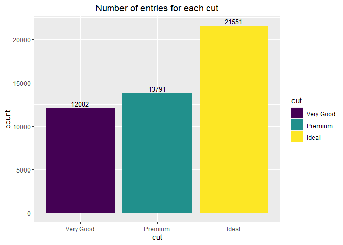

Mini Data Analysis Milestone 2
================

### Assignment B-1: Making a function

This document is a solution to questions states in the assignment. It
covers making a function in R, documenting it, and testing it.

### Setup

Loading the required packages

``` r
library(datateachr)
library(tidyverse)
```

    ## ── Attaching core tidyverse packages ──────────────────────── tidyverse 2.0.0 ──
    ## ✔ dplyr     1.1.3     ✔ readr     2.1.4
    ## ✔ forcats   1.0.0     ✔ stringr   1.5.0
    ## ✔ ggplot2   3.4.3     ✔ tibble    3.2.1
    ## ✔ lubridate 1.9.2     ✔ tidyr     1.3.0
    ## ✔ purrr     1.0.2     
    ## ── Conflicts ────────────────────────────────────────── tidyverse_conflicts() ──
    ## ✖ dplyr::filter() masks stats::filter()
    ## ✖ dplyr::lag()    masks stats::lag()
    ## ℹ Use the conflicted package (<http://conflicted.r-lib.org/>) to force all conflicts to become errors

``` r
library(testthat)
```

    ## 
    ## Attaching package: 'testthat'
    ## 
    ## The following object is masked from 'package:dplyr':
    ## 
    ##     matches
    ## 
    ## The following object is masked from 'package:purrr':
    ## 
    ##     is_null
    ## 
    ## The following objects are masked from 'package:readr':
    ## 
    ##     edition_get, local_edition
    ## 
    ## The following object is masked from 'package:tidyr':
    ## 
    ##     matches

### Exercise 1 and 2: Make and Document your Function

A plotting function has been made as part of this exercise.

1.  This function accepts a dataframe and grouping column as a
    parameter.  
2.  It then groups the entities of the column and counts the number of
    entries in each group.  
3.  The output is then plotted as a bar chart.

``` r
#' Function to group and plot the count of a column
#' 
#' This function is used to group a column, count the number of entries per group and plot a bar graph.
#' 
#' @param data_frame The dataframe on which the function is to be applied.
#' @param group_column The column of the dataframe which is to be grouped.
#' @returns A bar chart showing count of each grouped entity.
#' @example group_barchart(diamond, cut)

# Function that groups a column and plots the counted rows in each group
group_barchart <- function(data_frame, group_variable,...){
  label <- rlang::englue("Number of entries for each {{group_variable}}")
  
  data_frame %>%
  group_by({{group_variable}}) %>%
  summarise(count = n()) %>%
  arrange(desc({{group_variable}})) %>%
  ggplot(mapping = aes(x = {{group_variable}}, y = count)) +
  geom_bar(stat="identity") +
  labs(title = label)
}
```

### Exercise 3: Include examples

Examples of the function implementation have been shown below.

``` r
# First 6 rows of the diamond dataframe have been first analysed to choose the column to be grouped.

head(diamonds)
```

    ## # A tibble: 6 × 10
    ##   carat cut       color clarity depth table price     x     y     z
    ##   <dbl> <ord>     <ord> <ord>   <dbl> <dbl> <int> <dbl> <dbl> <dbl>
    ## 1  0.23 Ideal     E     SI2      61.5    55   326  3.95  3.98  2.43
    ## 2  0.21 Premium   E     SI1      59.8    61   326  3.89  3.84  2.31
    ## 3  0.23 Good      E     VS1      56.9    65   327  4.05  4.07  2.31
    ## 4  0.29 Premium   I     VS2      62.4    58   334  4.2   4.23  2.63
    ## 5  0.31 Good      J     SI2      63.3    58   335  4.34  4.35  2.75
    ## 6  0.24 Very Good J     VVS2     62.8    57   336  3.94  3.96  2.48

``` r
# In order to determine which cut is popular, group_barchart function has been used to make a bar chart.
group_barchart(diamonds, cut)
```

<!-- -->

``` r
# First 6 rows of the vancouver_trees dataframe have been first analysed to choose the column to be grouped.

head(vancouver_trees)
```

    ## # A tibble: 6 × 20
    ##   tree_id civic_number std_street genus_name species_name cultivar_name  
    ##     <dbl>        <dbl> <chr>      <chr>      <chr>        <chr>          
    ## 1  149556          494 W 58TH AV  ULMUS      AMERICANA    BRANDON        
    ## 2  149563          450 W 58TH AV  ZELKOVA    SERRATA      <NA>           
    ## 3  149579         4994 WINDSOR ST STYRAX     JAPONICA     <NA>           
    ## 4  149590          858 E 39TH AV  FRAXINUS   AMERICANA    AUTUMN APPLAUSE
    ## 5  149604         5032 WINDSOR ST ACER       CAMPESTRE    <NA>           
    ## 6  149616          585 W 61ST AV  PYRUS      CALLERYANA   CHANTICLEER    
    ## # ℹ 14 more variables: common_name <chr>, assigned <chr>, root_barrier <chr>,
    ## #   plant_area <chr>, on_street_block <dbl>, on_street <chr>,
    ## #   neighbourhood_name <chr>, street_side_name <chr>, height_range_id <dbl>,
    ## #   diameter <dbl>, curb <chr>, date_planted <date>, longitude <dbl>,
    ## #   latitude <dbl>

``` r
# In order to determine which street_side_name is popular, group_barchart function has been used to make a bar chart.
group_barchart(vancouver_trees, street_side_name)
```

<!-- --> \###
Exercise 4: Test the Function

Three different test_that functions have been written in order to test
the working of the function.

``` r
# Testing if ggplot object is returned
test_that("Plot returns ggplot object",{
  p <- group_barchart(diamonds, cut)
  expect_is(p,"ggplot")
})
```

    ## Test passed 😀

``` r
# Testing if the axis label is the same as column to be grouped
test_that("Scale is labelled 'cut'",{
  p <- group_barchart(diamonds, cut)
  expect_identical(p$labels$x, "cut")
})
```

    ## Test passed 😸

``` r
## Testing if the plot is being printed
test_that("Printing ggplot object actually works",{
    p <- group_barchart(diamonds, cut)
    expect_error(print(p), NA)})
```

<!-- -->

    ## Test passed 🎊
